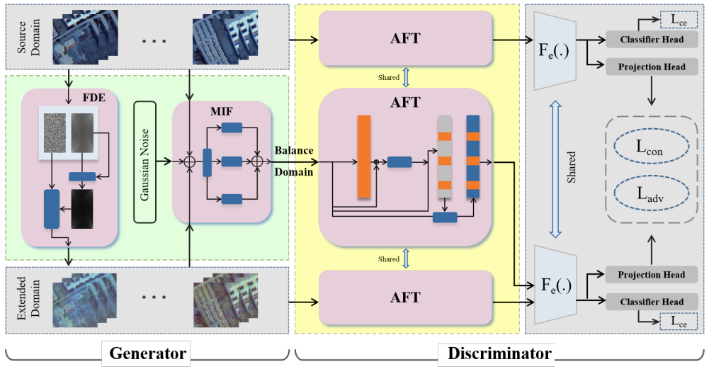

# Three-Dimensional Frequency-Domain Transform Network for Cross-Scene Hyperspectral Image Classification

<p align='center'>
  
</p>

## Abstract

Reducing inter-domain discrepancies effectively enhances the performance of hyperspectral cross-scene classification tasks. However, hyperspectral single-source domain generalization methods based on mining visual representation information are significantly influenced by inter-domain discrepancies. Recent research has demonstrated that frequency-domain information exhibits robust stability. Therefore, this paper proposes a Three-dimensional Frequency Domain Transform Network (TFTnet) for achieving hyperspectral single-source domain cross-scene classification tasks. To leverage the advantageous three-dimensional characteristics of hyperspectral images, all frequency domain transforms are implemented within a three-dimensional framework. The model consists of a generator and a discriminator. The generator incorporates a Frequency Domain Enhancement (FDE) module and a Multi-Source Information Fusion (MIF) module; the discriminator incorporates a set of weight-sharing Adaptive Frequency Domain Transform (AFT) modules. The FDE module generates the extended domain with a certain domain shift by doing linear interpolation in the amplitude interval of a single-source domain itself. The MIF module integrates multi-source information through inter-domain attention, ensuring a balanced approach between the source and extended domains, thus generates the effective balance domain. The AFT module empowers the discriminator to selectively acquire hyperspectral image frequency domain features, facilitating synergistic collaboration of spatial-spectral features  and frequency domain features for enhanced image comprehension. Extensive experiments on three public hyperspectral datasets show the superiority of the method compared to state-of-the-art techniques.

## Paper

Please cite our paper if you find the code or dataset useful for your research.

```
@ARTICLE{10050427,
  author={Zhang Jun, Zhang Cheng, Liu Shuai, Shi Zhenwei and Pan Bin},
  journal={IEEE TRANSACTIONS ON GEOSCIENCE AND REMOTE SENSING}, 
  title={Three-dimensional Frequency Domain Transform Network for Cross-Scene Hyperspectral Image Classification}, 
  year={2024},
  volume={},
  number={},
  pages={1-13},
  doi={}}

```

## Requirements

CUDA Version: 10.1

torch: 1.7.1

Python: 3.7

## Dataset

The dataset directory should look like this:

```bash
datasets
├── Houston
│   ├── Houston13.mat
│   ├── Houston13_7gt.mat
│   ├── Houston18.mat
│   └── Houston18_7gt.mat
└── Pavia
|   ├── paviaC.mat
|   ├── paviaC_7gt.mat
|   ├── paviaU.mat
|   └── paviaU_7gt.mat
└── SH-HZ
    └── DataCube.mat

```

## Usage

1.You can download [Houston &amp; Pavia](https://drive.google.com/drive/folders/1No-DNDT9P1HKsM9QKKJJzat8A1ZhVmmz?usp=sharing) dataset here.

2.You can change the `source_name` and `target_name` in train.py to set different transfer tasks.

3.Run the following command:

Houston dataset:
```
python train.py --source_name Houston13 --target_name Houston18 --re_ratio 5 --training_sample_ratio 0.8 --d_se 64 --lambda_1 1.0 --lambda_2 1.0
```
Pavia dataset:  
```
python train.py --source_name paviaU --target_name paviaC --re_ratio 1 --training_sample_ratio 0.5 --d_se 64 --lambda_1 1.0 --lambda_2 1.0
```
SH-HZ dataset:  
```
python train.py --source_name hangzhou --target_name shanghai --re_ratio 1 --training_sample_ratio 0.8 --d_se 64 --lambda_1 1.0 --lambda_2 1.0
```
